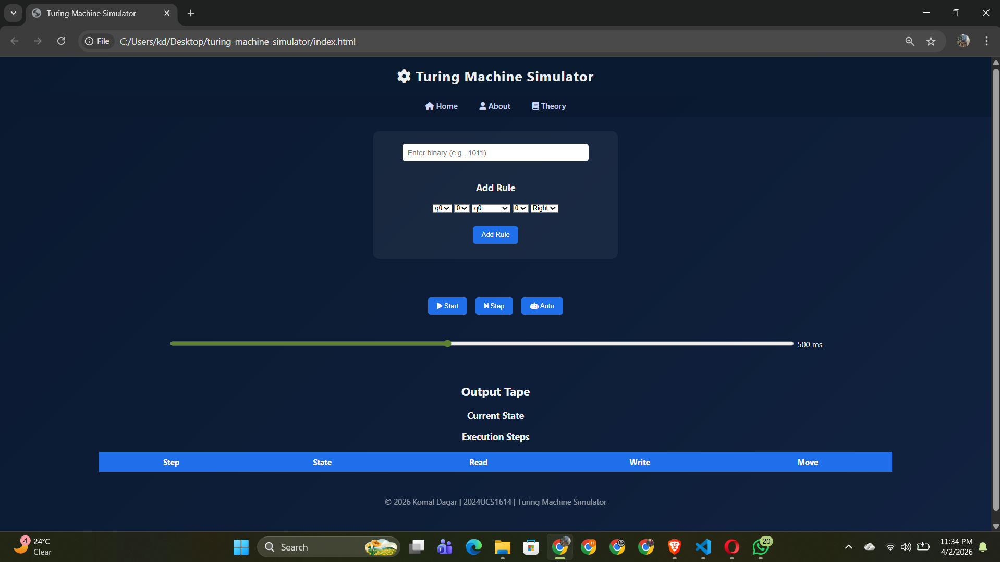
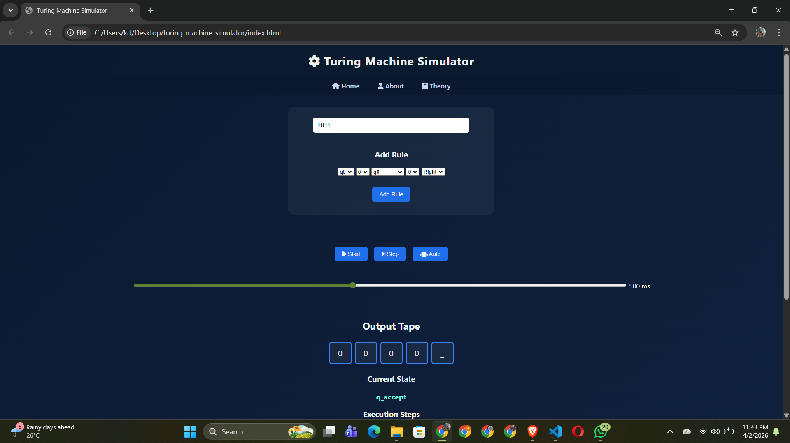
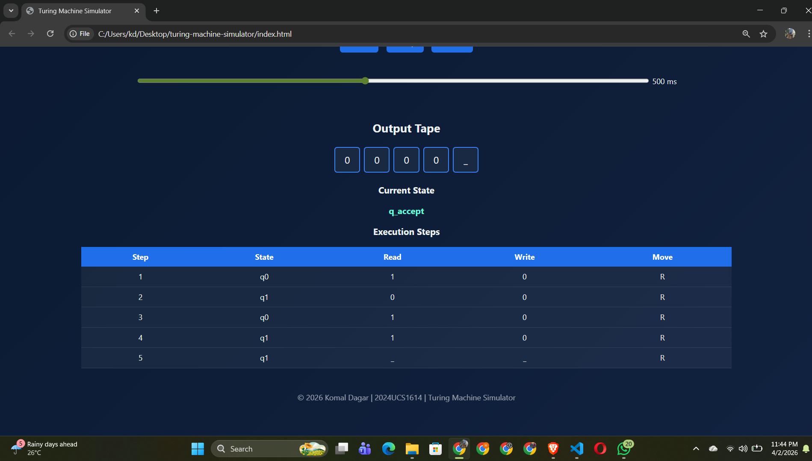
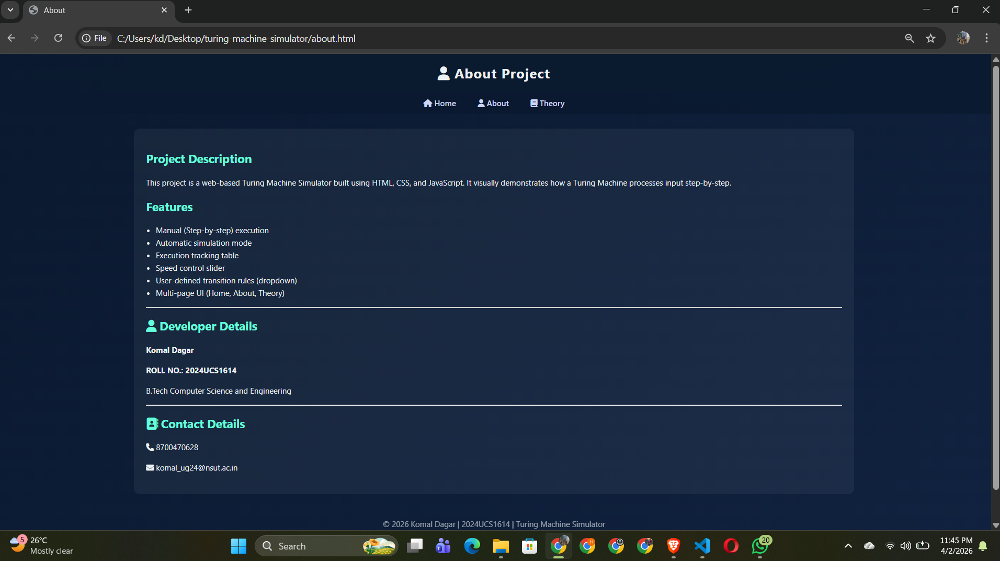
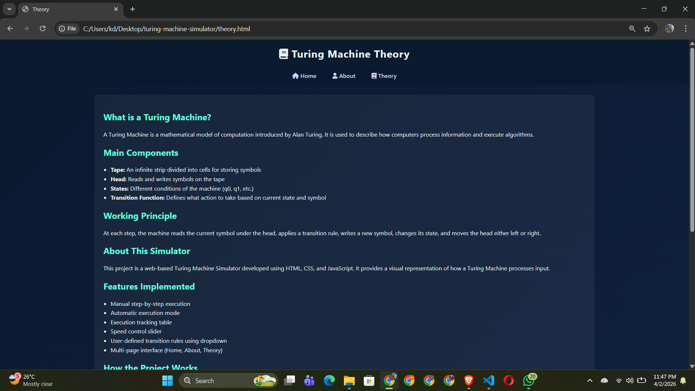
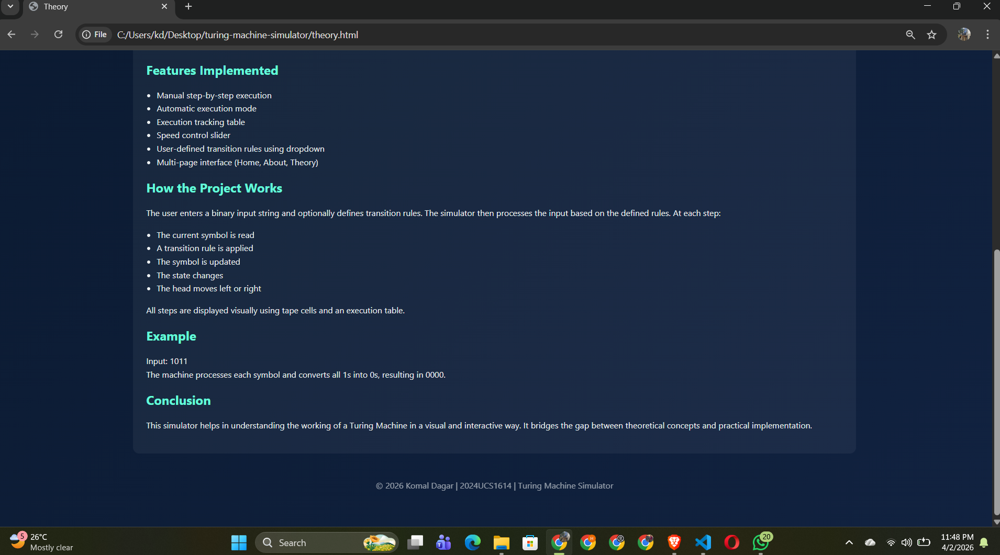

# Turing Machine Simulator

## 📌 Project Description
This project is a web-based Turing Machine Simulator built using HTML, CSS, and JavaScript.  
It visually demonstrates how a Turing Machine processes input step-by-step.

---

## 🚀 Features
- Manual (step-by-step) execution
- Automatic simulation mode
- Execution tracking table
- Speed control slider
- User-defined transition rules (UI-based)
- Multi-page interface (Home, About, Theory)
- Clean and modern UI design

---

## 🧠 How It Works
1. User enters a binary input string
2. Machine reads symbol under head
3. Applies transition rule
4. Writes new symbol
5. Moves head left or right
6. Changes state

---

## 📸 Screenshots

### 🔹 Home Page

### 🔹 Execution

### 🔹 Execution Steps

### 🔹 About Page

### 🔹 Theory Page

---

## 🛠️ Technologies Used
- HTML
- CSS
- JavaScript

---

## 👨‍💻 Developer
**Komal Dagar**  
**ROLL NO.: 2024UCS1614**
B.Tech Computer Science and Engineering

---

## 📞 Contact
Phone: 8700470628
Email: komal_ug24@gmail.com

---